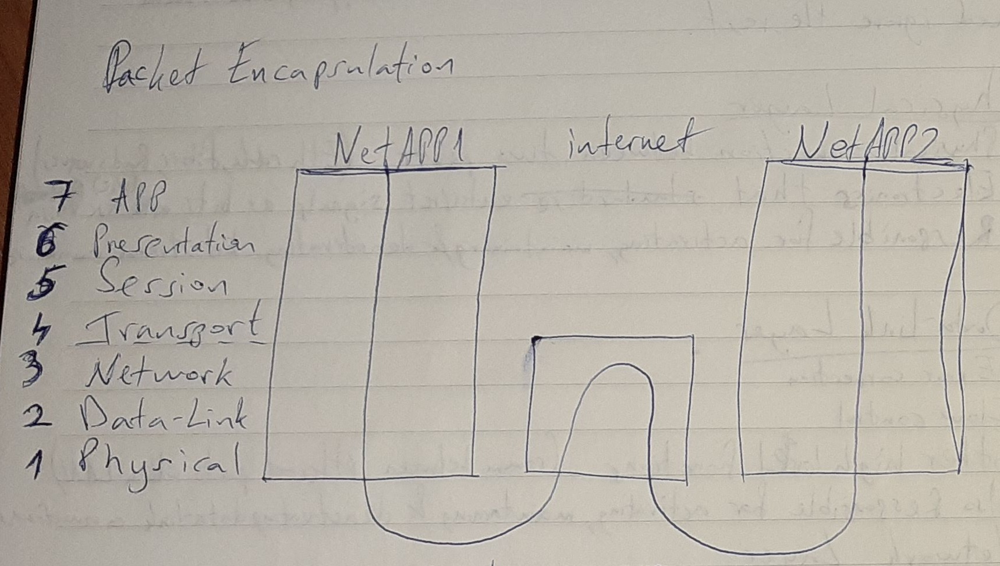

# Networking

## OSI Model

Layers allow routers, browsers, network cards, ... to focus on one particular aspect of communication that applies to them and ignore the rest.

### (1) Physical Layer

* Physical connection between two points (Ethernet cable, fiber, EM Waves)
* NIC - Electronics that enterpret different kinds of signals to binary and vise versa
* Responsible for activating, maintaining & deactivating bitstream commhnication

### (2) Data-Link Layer

* Error Correction
* Flow Control
* other high level functions (comm between ethernet ports within LAN)
* Also Responsible for activating, maintaining & deactivating data-link connections

### (3) Network Layer

* Addressing
* Routing

### (3) Transport Layer

* Reliablity of data transmissions
* Cost-effectiveness of data transmission

### (5) Session Layer

Establishes and maintains connection between network applications

It's not a protocol, but an abstraction of TCP. Example: instead of sending syn, waiting for syn/ack & sending ack, the Session Layer provides a connect function that does all that under the hood)

### (6) Presentation Layer

Encoding, Conpressing, Encryption & reverse, jso that app layer understands data and insctructions

### (7) Application Layer

The language that two nodes must speak to exchange information & commands.
Some Applications are: http (www), imap, smtp, pop3, ssh, ftp

Packet Encapsulation

OS takes care of details of network encapsulation by using its network interface

## The Network Interface

### Sockets

Provides communication at the session layer

* Stream Socket (TCP)
* Datagram Socket (UDP)

#### Socket Functions: /usr/include/sys/socket.h

* `bind(fd, local_ip_and_port_struct, struct_len)` -> 0 / -1 err
* `listen(fd, backlog_queue_size)` -> 0 / -1 err | queues connection requests
* `accept(fd, remote_ip_and_port_struct, struct_len*)` -> new_fd / -1 err
* `connect(fd, remote_ip_and_port_struct, struct_len)` -> 0 / -1 err
* `send(fd, buffer, size, flags)` -> n# bytes written / -1 err
* `recv(fd, buffer, size, flags)` ->n# bytes received / -1 err
* `setsockopt(fd, option_layer, option, option_val, sizeof(option_val))` -> 0 / -1 err
* `shutdown(fd, SHUT_RDWR)` // closes socket gracefuly

#### Protocol Families: /usr/include/bits/socket.h

#define PF_LOCAL 1
#define PF_UNIX PF_LOCAL
#define PF_FILE PF_LOCAL
#define PF_INET 2
...
...
#define PF_INET6 10
...
...

One Protocol Family may include multiple protocols.
PF_INET & PF_INET6 each have only one protocol, so the last argument of socket(...) is 0 (or the first element in the family).

#### Types of Sockets: /usr/include/bits/socket.h

enum __socket_type {
    SOCK_STREAM = 1;
    #define SOCK_STREAM SOCK_STREAM
    SOCK_DGRAM = 2;
    #define SOCK_DGRAM SOCK_DGRAM
    ...
    ...
}

#### Socket Addresses

The sockaddr struct in our examples, named ..._ip_and_port_struct, is defined in: /usr/include/bits/socket.h
Evethough there is no interfaces in C, sockaddr acts like one, since protocol family specific socket addresses get typecast to the generic sockaddr when passed to socket functions.

#include <bits/sockaddr.h>

struct sockaddr {
    __SOCKADDR_COMMON (sa_); // addrfam & its len
    char sa_data\[14\]; // addr data
    
}; // total size: 16B

#### Address Families: /usr/include/bits/socket.h
.
.
.
#define AF_INET PF_INET

#### Internet Socket Address (AF_INET struct): /usr/include/netinet/in.h

struct sockaddr_in {
    __SOCKADDR_COMMON (sin_); // 2
    in_port_t sin_port; // big endian short int +2
    struct in_addr sin_addr; // big endian in +4
    usigned char sin_zero[sizeof(struct sockaddr) - __SOCKADDR_COMMON_SIZE - sizeof(in_port_t) - sizeof(struct in_addr)];
}; // sin_zero is the padding, so that every sockaddr type is the same size, an can be typecast from one to the other (or if not, at least you know the exact buffer size). In this case 16-2-2-4 = 8B padding

#### Big Endian - little endian conversion functions:
/usr/include/netinet/in.h & /usr/include/arpa/inet.h

* htonl(long value) // host-to-network long
* htons(short value)
* ntohl(long value)
* ntohs(short value)

#### Internet Address Cenversion: arpa/inet.h

##### ASCII to Net ("127.0.0.1" -> 0x7F 0x0 0x0 0x01)
inet-aton(char *ascii_addr, struct in_addr *net_addr_)

##### Net to ASCII
inet_ntoa(struct in_addr *net_addr)

## Implementing
### simple server fineprints*

1. Declare a bunch of variables (int yes 21)
2. socket(...)
3. setsockopt(sockfd, SOL_SOCKET, SO_REUSEADDR, &yes, sizeof(int))
// SO_REUSEADDR -> able to rebind to a port already in use
// SOL_SOCKET -> since it's a socket level (session layer) option. More options in asm/socket.h
4. setup sockaddr_in struct:
host_addr.sin_family = AF_INET;
host_addr.sin_port = htons(PORT);
host_addr.sin_addr.s_addr=0; // autofill my ipaddr
memset(&(host_addr.sin_zero), '\0', 8); //zero out padding
5. bind(..., (struct sockaddr *)&host_addr, ...)
6. listen(...)
7. while(1)
8. accept(...)
9. send(...)
10. recv(...)

## HTTP
(app layer protocol)

Default Ports: **/etc/services**
**Root privs are needed to bind to any port below 1024**
POP3, SMTP, IMAP & FTP's control channel ALSO use plaintext.

Example:
`telnet internic.net 80`
.
.
.
`> HEAD / HTTP/1.0          #(command resource protocol_version)`

`HTTP/1.1 200 OK`
`Date: Fri, 14 Sep.`
`Server: Apache/2.-.52 (CentOS)`
`Accept-Ranges: bytes`
`Content-Length:6743`
`Connection: close`
`Contet-type: text/html; charset=UTF-8`

`Connection closed by foreign host.`

In HTTP Req & Resp:
Each of the lines end in "\r\n" (-x0D0A) (this is how lines end in windows text files, as contrasted by linux endl ines"\n")
Each of the http response Header lines are sent once per buffer rewrite, according to hacking-network.h from the book.